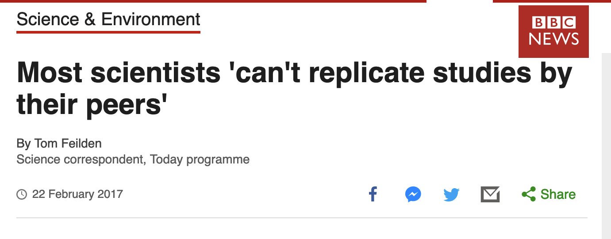
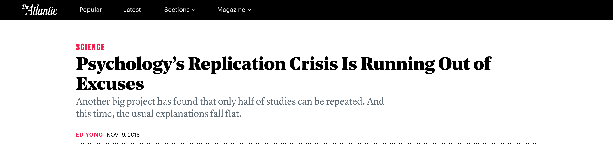

# Towards Unreproducible Research with Extremely Random Seeds

Zach Lipp

30 October 2019

---

### `$whoami`

- Data Scientist
- Software Engineer
- Science Enjoyer

---

### Random seeds

- "Random seeds" are values used to start random number generators
- Given the same random seed, your random processes should produce the same results
- Important for reproducible science 

---

### Reproducibility

Science is in a "reproducibility crisis"

---



---



---

### This conversation is one-sided

What about us who don't want our research reproduced?

---

<div class="right" style="float: left; width: 45%;">

<div class="caption" style="font-size: 9px">
By <a rel="nofollow" class="external text" href="https://www.flickr.com/people/22882274@N04">Anthony Quintano</a> from Honolulu, HI, United States - <a rel="nofollow" class="external text" href="https://www.flickr.com/photos/quintanomedia/41118886324/">Mark Zuckerberg F8 2018 Keynote</a>

<a href="https://creativecommons.org/licenses/by/2.0" title="Creative Commons Attribution 2.0">CC BY 2.0</a>, <a href="https://commons.wikimedia.org/w/index.php?curid=79154080">Link</a>
</div>
</div>

<div class="left" style="float: right; width: 45%; max-height: 430px">

<div class="caption" style="font-size:9px">
By Max Morse for TechCrunch <a rel="nofollow" class="external text" href="https://www.flickr.com/people/52522100@N07">TechCrunch</a> - <a rel="nofollow" class="external text" href="https://www.flickr.com/photos/techcrunch/15178532521/">TechCrunch Disrupt San Francisco 2014</a>,

<a href="https://creativecommons.org/licenses/by/2.0" title="Creative Commons Attribution 2.0">CC BY 2.0</a>, <a href="https://commons.wikimedia.org/w/index.php?curid=45609023">Link</a>
</div>
</div>

---

### Worst-case scenario

If you are:
- Forced to use Python
- Forced to seed random processes

Can you still make unreproducible results?

---

### Yes!

---

### Introducing *Extremely Random Seeds*

```python
import random

class ExtremelyRandomSeed:
    @staticmethod
    def _get_nondeterministic():
        return random.randint(0, 100)
```

---

### Case Study: `random.seed`

---

### `random.seed (Python<=3.8)`

```python
class Random(_random.Random):
  ...
    def seed(self, a=None, version=2):
        """Initialize internal state from hashable object.
  ...
```

---

### `base.py`

```python 
import random

class ExtremelyRandomSeed:
    @staticmethod
    def _get_nondeterministic():
        return random.randint(0, 100)

class BaseSeed(ExtremelyRandomSeed):
  def __hash__(self):
    return self._get_nondeterministic()

if __name__ == "__main__":
  seed = BaseSeed()
  random.seed(seed)
  print(random.random())
```

---

### Results

```
➜ python3 base.py
0.2718754143840908

➜ python3 base.py
0.7915259359614659
```
---

### Generalizing ExtremelyRandomSeed

Same idea extends to the scientific Python stack:
- `numpy`: `__array__`
- `pytorch`: `__int__`
- `tensorflow>=2.0.0`: `__mod__`

Here's a [gist](https://gist.github.com/zachlipp/33de439603bd2825f6bdb9e73d6b34fd) with a working example, more details coming soon

---

### Takeaways:

- Nonreproducible research made easy

---

### Actual Takeaways:

1. Every library I'm using coerces objects for seeding differently
2. "dunder" (`__<>__`) methods are powerful
3. Defensive programming may be the answer

---

### `random.seed (Python>=3.9)`

```python
class Random(_random.Random):
  ...
  def seed(self, a=None, version=2):
    ...
    elif not isinstance(a, (type(None), int, float, str, bytes, bytearray)):
      _warn('Seeding based on hashing is deprecated\n'
            'since Python 3.9 and will be removed in a subsequent '
            'version. The only \n'
            'supported seed types are: None, '
            'int, float, str, bytes, and bytearray.',
            DeprecationWarning, 2)
```

---

### Fin

