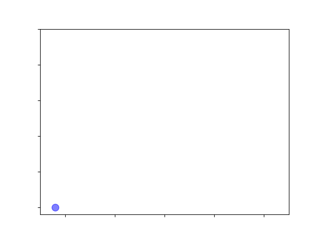

# Insignificant Statistics 

Zach Lipp

Senior Software Engineer, Lumere

15 January 2020

---

## Roadmap
- What is statistical significance?
- Why not use statistical significance?
- What other options do we have?

---

## What is statistical significance? 

---

###  Signficance 101 
- We want to know whether our data signifies a real difference or one that could just be random
<!-- .element: class="fragment" data-fragment-index="1" -->
- We use a very specific test (or "tool") to determine significance
<!-- .element: class="fragment" data-fragment-index="2" -->
- Significance is often a precursor to publishing research or taking an empirical study seriously
<!-- .element: class="fragment" data-fragment-index="3" -->

---

### Example: Income Distribution
- Let's say we compare average income between groups and find differences
<!-- .element: class="fragment" data-fragment-index="1" -->
- One we expect: Software engineers vs. librarians 
<!-- .element: class="fragment" data-fragment-index="2" -->
- One that surprises us: People born on even-numbered dates vs. people born on odd-numbered dates
<!-- .element: class="fragment" data-fragment-index="3" -->
- How do we know what's real?
<!-- .element: class="fragment" data-fragment-index="4" -->
---

### Significance 201 
- The standard measure of significance is whether the "p-value" of a statistical test is below the threshold of ($p <= 0.05$)
<!-- .element: class="fragment" data-fragment-index="1" -->
- If the observed values came from the same distribution, we would see results this or more extreme only 5% of the time
<!-- .element: class="fragment" data-fragment-index="2" -->

---

### Significance 201: Visualizing with Python

Full code available here

```python
from datetime import datetime

import matplotlib.pyplot as plt
import numpy as np
import seaborn as sns

if __name__ == "__main__":
    np.random.seed(1337)
    mean = 0
    std = 1

    dist = np.random.normal(mean, std, size=500)
    # Vectorized rounding
    rounded = np.round_(dist, 1)

    # Plot distribution point-by-point
    fig, ax = plt.subplots()
    counts = dict()
    for i, x in enumerate(rounded):
        y = counts.get(x, 0) + 1
        plt.scatter(x, y, s=100, alpha=0.5, color="b")
        plt.xlim(-2.5, 2.5)
        plt.ylim(-1, 25)
        ax.set_yticklabels([])
        ax.set_xticklabels([])
        counts.update({x: y})
        filename = "anim/" + datetime.now().strftime("%d%H%M%S%f") + ".png"
        plt.savefig(filename)
```

---

### Significance 201: Sampling the same distribution


---

### Significance 201: Differences between samples


<!-- .element: class="fragment fade-out" data-fragment-index="1" -->

<!-- .element: class="fragment" data-fragment-index="1" style="top:75px; position:absolute; z-index:1; display:block; left:150px;"-->

---

### Significance 201

$p <= 0.05$ is an arbitrary threshold


---

### Significance 201

$p <= 0.05$ is an arbitrary threshold


---

### Significance 201

$p <= 0.05$ is an arbitrary threshold


---

## There's a problem

---


---


<!-- .element: class="fragment fade-out" data-fragment-index="0" -->


<!-- .element: class="fragment fade-in" data-fragment-index="0" style="top:0px; position:absolute;" -->

---

> Don't conclude anything about scientific or practical importance based on statistical significance


<!-- .element: class="fragment fade-in" data-fragment-index="0"-->
---

## Why not use statistical significance?

---

### Problem 1: Interpretability

---

### Problem 1: Interpretability

[Multiple](hhttps://www.metheval.uni-jena.de/lehre/0405-ws/evaluationuebung/haller.pdf) [studies](https://www.frontiersin.org/articles/10.3389/fpsyg.2016.01247/full) [show](https://www.ncbi.nlm.nih.gov/pubmed/26260938/) academics cannot correctly explain or interpret p-values when specifically asked to

---

### Problem 1: Interpretability
Academics get this wrong even in formal settings


---

### Problem 1: Interpretability
This is all very hard to communicate to a general audience


<!-- .element: class="fragment fade-in-then-out" data-fragment-index="1" style="position:relative;"-->


<!-- .element: class="fragment" data-fragment-index="2" style="top:300px; position:absolute; z-index:1;"-->

---

### Problem 2: Susceptible to data dredging

---

### Problem 2: Susceptible to data dredging


---

### Problem 2: Susceptible to data dredging


---

### Problem 2: Susceptible to data dredging


---

### Problem 2: Susceptible to data dredging

Statistician Augustin Cournot:
> ...[T]he groupings that the experimenter went through leave no trace; the public only sees the result that seemed to merit being brought to its attention.  Consequently, an individual unacquainted with the system of groupings that preceded the result will have absolutely no fixed rule for betting on whether the result can be attributed to chance.

---

### Problem 2: Susceptible to data dredging

This phenomenon has many names:

- *data dredging*
- *p-hacking*
- *the garden of forking paths*
- *researchers degrees of freedom*

This isn't really malpractice; it can feel like a natural part of research
<!-- .element: class="fragment" data-fragment-index="1" -->

---

## Python Application: City of Chicago Employee Income


---

### Application: City of Chicago Income

```python
import pandas as pd

url = "https://data.cityofchicago.org/api/views/xzkq-xp2w/rows.csv?accessType=DOWNLOAD"
df = pd.read_csv(url)
df.head()
```

<table border="1" class="dataframe">
  <thead>
    <tr style="text-align: right;">
      <th>Name</th>
      <th>Job Titles</th>
      <th>Department</th>
      <th>Full or Part-Time</th>
      <th>Salary or Hourly</th>
      <th>Typical Hours</th>
      <th>Annual Salary</th>
      <th>Hourly Rate</th>
    </tr>
  </thead>
  <tbody>
    <tr>
      <td>...</td>
      <td>SERGEANT</td>
      <td>POLICE</td>
      <td>F</td>
      <td>Salary</td>
      <td>NaN</td>
      <td>101442.0</td>
      <td>NaN</td>
    </tr>
    <tr>
      <td>...</td>
      <td>POLICE OFFICER...</td>
      <td>POLICE</td>
      <td>F</td>
      <td>Salary</td>
      <td>NaN</td>
      <td>94122.0</td>
      <td>NaN</td>
    </tr>
  </tbody>
</table>   

---

### Application: City of Chicago Income

```python
salaried = df[df["Salary or Hourly"] == "Salary"]

print(salaried.shape)
> (25638, 8)
```

---

### Application: City of Chicago Income

```python
import numpy as np
from pandas.core.frame import DataFrame
from scipy import stats


def report_significant_results(
    data: DataFrame, group_field: str, value_field: str, max_subgroups: int
) -> None:
    """
    Given dataframe and the names of a continous value series and a discrete
    grouping series, find if subgroups within that groups have significant
    differences between the rest of the data using one-way ANOVA
    """
    # Get the top N most populated subgroups
    most_popular_subgroups = (
        data[group_field].value_counts()[:max_subgroups].index.tolist()
    )

    significant = 0
    for subgroup in most_popular_subgroups:
        subgroup_index = data[group_field] == subgroup

        subgroup_data = data.loc[subgroup_index, value_field].values
        non_subgroup_data = data.loc[~subgroup_index, value_field].values

        # One way ANOVA test
        anova = stats.f_oneway(subgroup_data, non_subgroup_data)

        if anova.pvalue <= 0.05:
            print(
                f"Significant result! {subgroup} (p={anova.pvalue})"
            )
            significant += 1

    percent_significant = np.round(
        significant / len(most_popular_subgroups) * 100, 2
    )

    print("\n", "-" * 50, "\n")

    print(
        f"In total, {percent_significant}% of results are statistically "
        "significantly different.\n"
        f"If there were no differences between groups, we'd expect 5% "
        "of results to differ at this level by chance alone."
    )
```

---

### Application: City of Chicago Income
Let's analyze three differences: One we know is real, one that could be real, and one we know isn't real

---

### Application: City of Chicago Income
#### Real Difference

```python
report_significant_results(salaried, "Department", "Annual Salary", 100)
```

```stdout
Significant result! POLICE (p=1.8468111302573452e-14)
Significant result! FIRE (p=2.174279584156084e-268)
Significant result! OEMC (p=1.0707354108347402e-51)
Significant result! PUBLIC LIBRARY (p=3.5034319505868517e-85)
Significant result! AVIATION (p=3.8695104691047463e-28)
Significant result! FINANCE (p=5.075077358669207e-50)
Significant result! TRANSPORTN (p=7.263739543135015e-07)
Significant result! LAW (p=4.8846349176789126e-05)
Significant result! WATER MGMNT (p=1.5140704784943785e-10)
Significant result! FAMILY & SUPPORT (p=0.0003532995236513321)
Significant result! CITY COUNCIL (p=2.2926992052529415e-44)
Significant result! BUILDINGS (p=7.170095080321337e-43)
Significant result! BUSINESS AFFAIRS (p=0.006310311905491887)
Significant result! COPA (p=0.001895189468410489)
Significant result! BOARD OF ELECTION (p=3.627323482741998e-76)
Significant result! DoIT (p=3.792899736506571e-17)
Significant result! CITY CLERK (p=6.352894307231167e-12)
Significant result! MAYOR'S OFFICE (p=3.2436138948614145e-11)
Significant result! ANIMAL CONTRL (p=2.2675557130192936e-11)
Significant result! BUDGET & MGMT (p=0.0003868357815750312)

 -------------------------------------------------- 

In total, 55.56% of results are statistically significantly different.
If there were no differences between groups, we'd expect 5% of results to differ at this level by chance alone.
```
<!-- .element: class="fragment" data-fragment-index="1" -->

---

### Application: City of Chicago Income
#### Possibly Real Difference

```python
# Remove all characters after the comma
salaried["last_name"] = salaried["Name"].str.replace(r",[\s\S]+", "")
report_significant_results(salaried, "last_name", "Annual Salary", 100)
```

```stdout
Significant result! WILLIAMS (p=0.0003461218856700791)
Significant result! RODRIGUEZ (p=0.0010919920125766129)
Significant result! GONZALEZ (p=0.0009999687731524506)
Significant result! BROWN (p=0.007659444102446966)
Significant result! MARTINEZ (p=0.0006984165301994624)
Significant result! HERNANDEZ (p=0.0035092817347401896)
Significant result! JACKSON (p=0.034824300404728364)
Significant result! TORRES (p=0.020906283559724778)
Significant result! WILSON (p=0.023822053311617932)
Significant result! THOMAS (p=2.42206528436745e-06)
Significant result! MURPHY (p=0.00053217762436662)
Significant result! GOMEZ (p=0.012550839154663944)
Significant result! DIAZ (p=0.04697932655102837)
Significant result! TAYLOR (p=0.03657871906184533)
Significant result! KELLY (p=0.04798764692672744)
Significant result! WALSH (p=0.002870694976816721)
Significant result! HILL (p=0.02379690350157897)
Significant result! SULLIVAN (p=0.005925480045830458)
Significant result! ARROYO (p=0.037499370267462376)
Significant result! ESTRADA (p=0.008361329891584448)
Significant result! SANDOVAL (p=0.032383616541920505)
Significant result! O CONNOR (p=0.042513895228356705)
Significant result! VARGAS (p=0.019860309277097945)
Significant result! GALLAGHER (p=0.008540663678927892)
Significant result! MORGAN (p=0.028299753474974314)
Significant result! DOYLE (p=0.040687043599224856)

 -------------------------------------------------- 

In total, 26.0% of results are statistically significantly different.
If there were no differences between groups, we'd expect 5% of results to differ at this level by chance alone.
```
<!-- .element: class="fragment" data-fragment-index="1"-->

---

### Application: City of Chicago Income
#### Spurious Difference

```python
import numpy as np
np.random.seed(1337)

salaried.loc[:, "random"] = np.random.normal(size=salaried.shape[0])
report_significant_results(salaried, "last_name", "random", 500)
```

```stdout
Significant result! ROBINSON (p=0.02709571033660603)
Significant result! SCOTT (p=0.03356738756901648)
Significant result! BRYANT (p=0.01777737022807866)
Significant result! MORENO (p=0.049088564904976435)
Significant result! QUINN (p=0.014622137798088181)
Significant result! SALGADO (p=0.0021390679683443835)
Significant result! PATTERSON (p=0.048423831144796085)
Significant result! BAKER (p=0.012414622998105524)
Significant result! LEON (p=0.02178872804687049)
Significant result! SOLIS (p=0.011985540223764996)
Significant result! OWENS (p=0.02357342986917815)
Significant result! MARSHALL (p=0.021090814544345287)
Significant result! HUDSON (p=0.02843511210313691)
Significant result! FUENTES (p=0.022715469944018126)
Significant result! MATOS (p=0.025381697838516334)
Significant result! STONE (p=0.04185455282173281)
Significant result! ALMANZA (p=0.0317423466959263)

 -------------------------------------------------- 

In total, 3.4% of results are statistically significantly different.
If there were no differences between groups, we'd expect 5% of results to differ at this level by chance alone.
```
<!-- .element: class="fragment" data-fragment-index="1"-->

---

### Application: Summarised

- We never see the for loops
- We don't know how many comparisons occurred


<!-- .element: class="fragment" data-fragment-index="1"-->

---

-FIX


---

## What do we do? 

---

### A bad idea: Just lower the threshold!

$p <= 0.05 \rightarrow p <= 0.005$

- Doesn't solve either of our problems
<!-- .element: class="fragment" data-fragment-index="1"-->
- We've known this for a long time
<!-- .element: class="fragment" data-fragment-index="1"-->

---

### A bad idea: Just lower the threshold!

> Consequently, an individual unacquainted with the system of groupings that preceded the result will have absolutely no fixed rule for betting on whether the result can be attributed to chance.


<!-- .element: class="fragment" data-fragment-index="1"-->

---

### Good idea for researchers: Use statistical learning basics

If we're trying to find relationships that generalize, show that they do!

<div>

<!-- .element: class="fragment" data-fragment-index="1"-->
- Hold out sets (`sklearn.model_selection.train_test_split`)
</div>

<div>

<!-- .element: class="fragment" data-fragment-index="2"-->
- Cross-validation (`sklearn.model_selection.KFold`)
</div>

<div>

<!-- .element: class="fragment" data-fragment-index="3"-->
- Feature selection methods like Recursive Feature Elimination (RFE) (`sklearn.feature_selection.RFE`)
</div>

---

### Good idea for everyone: Be skeptical


<!-- .element: class="fragment" data-fragment-index="1"-->

---

<!-- .slide: style="font-size: .7em;" -->
### Suggested Reading
- [Hannah Fry, *What Statistics Can and Can’t Tell Us About Ourselves*, **New Yorker**](https://www.newyorker.com/magazine/2019/09/09/what-statistics-can-and-cant-tell-us-about-ourselves)

- [Valentin Amrhein, Sander Greenland, Blake McShane, *Scientists rise up against statistical significance*, **Nature**](https://www.nature.com/articles/d41586-019-00857-9)

- [Ronald L. Wasserstein, Allen L. Schirm, and Nicole A. Lazar, *Moving to a World Beyond “p < 0.05”*, **The American Statistician**](https://amstat.tandfonline.com/doi/full/10.1080/00031305.2019.1583913)

- [Glenn Shafer, *On the nineteenth-century origins ofsignificance testing and p-hacking*, **The Game-Theoretic Probability and Finance Project**](http://probabilityandfinance.com/articles/55.pdf)

---

<!-- .slide: style="font-size: .7em;" -->
### Suggested Reading
- [Sci-kit Learn Cross-Validation Tutorial](https://scikit-learn.org/stable/modules/cross_validation.html#cross-validation)
- [Sci-kit Learn Feature Selection Tutorial](https://scikit-learn.org/stable/modules/feature_selection.html)
---

## Fin
